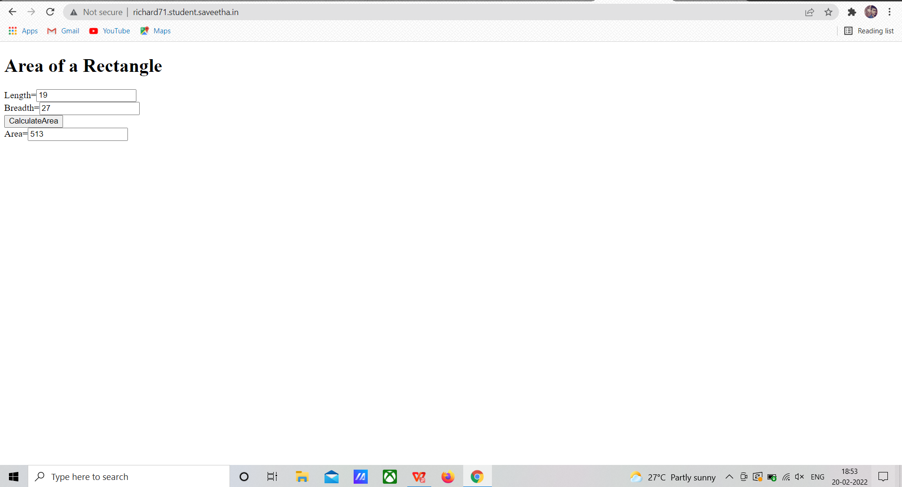

# Design a Website for Server Side Processing...

## AIM:
To design a website to perform mathematical calculations in server side.

## DESIGN STEPS:

### Step 1:
Create a new Angular project.

### Step 2:
Inside project create app called mathapp.

### Step 3:
Create a html called area.html .

### Step 4:
Do the mathematical part in views.py .

### Step 5:
Give the urls in urls.py.

### Step 6:
Publish the website in the given URL : http://richard71.student.saveetha.in/ .

## PROGRAM :

### area.html:
```
<!DOCTYPE html>
<html>
<head>
    <meta charset='utf-8'>
    <meta http-equiv='X-UA-Compatible' content='IE=edge'>
    <title>Page Title</title>
    <meta name='viewport' content='width=device-width, initial-scale=1'>
    <link rel='stylesheet' type='text/css' media='screen' href='main.css'>
    <script src='main.js'></script>
</head>
<body>
<h1>Area of a Rectangle</h1>
<form method='POST'>
    
Length=<input type="text" name="length" value={{l}}></input></br>
Breadth=<input type="text" name="breadth" value={{b}}></input></br>
<input type="submit" value="CalculateArea"></input></br>
Area=<input type="text" name="area" value={{area}}></input></br>
</form>
</body>
</html>
```

### views.py:
```
from django.shortcuts import render

# Create your views here.

def areacalculation(request):
    context = {}
    context['area'] = "0"
    context['l'] = "0"
    context['b'] = "0"
    if request.method == 'POST':
       l = request.POST.get('length','0')
       b = request.POST.get('breadth','0')
       area = int(l) * int(b)
       context['area'] = area
       context['l'] = l
       context['b'] = b
    return render(request,'mathapp/area.html',context)
```

### urls.py:
```
"""calc URL Configuration

The `urlpatterns` list routes URLs to views. For more information please see:
    https://docs.djangoproject.com/en/3.1/topics/http/urls/
Examples:
Function views
    1. Add an import:  from my_app import views
    2. Add a URL to urlpatterns:  path('', views.home, name='home')
Class-based views
    1. Add an import:  from other_app.views import Home
    2. Add a URL to urlpatterns:  path('', Home.as_view(), name='home')
Including another URLconf
    1. Import the include() function: from django.urls import include, path
    2. Add a URL to urlpatterns:  path('blog/', include('blog.urls'))
"""
from django.contrib import admin
from django.urls import path
from mathapp import views

urlpatterns = [
    path('admin/', admin.site.urls),
    path('areaofrectangle/',views.areacalculation,name="areaofrectangle"),
     path('',views.areacalculation,name="areaofrectangleroot"),
]
```

## OUTPUT:


## Result:
The code to execute mathematical website in server side has been created successfully.
